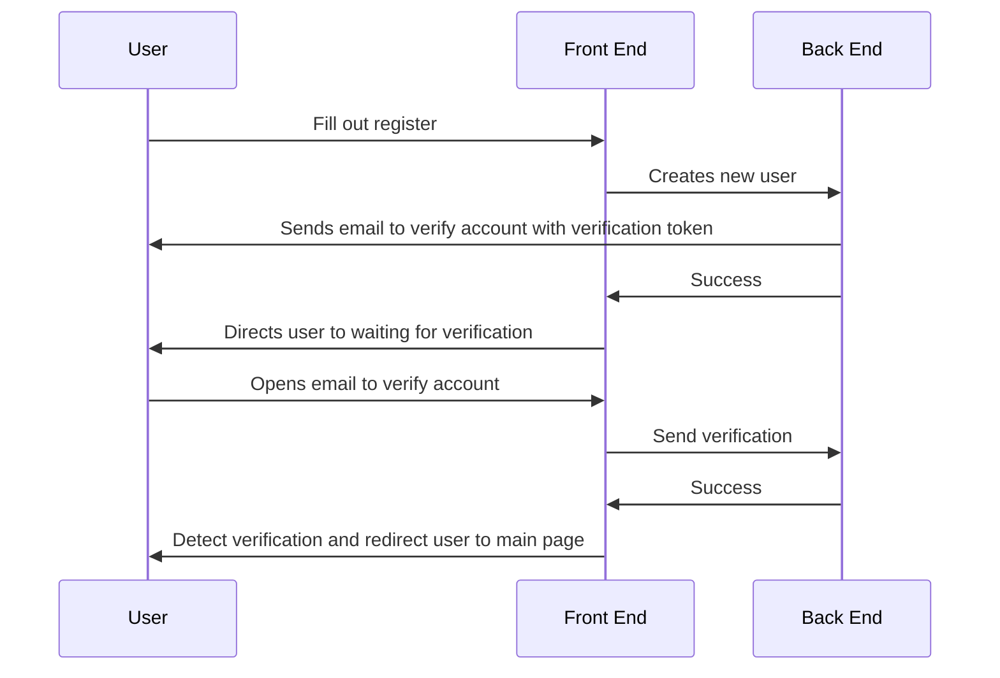
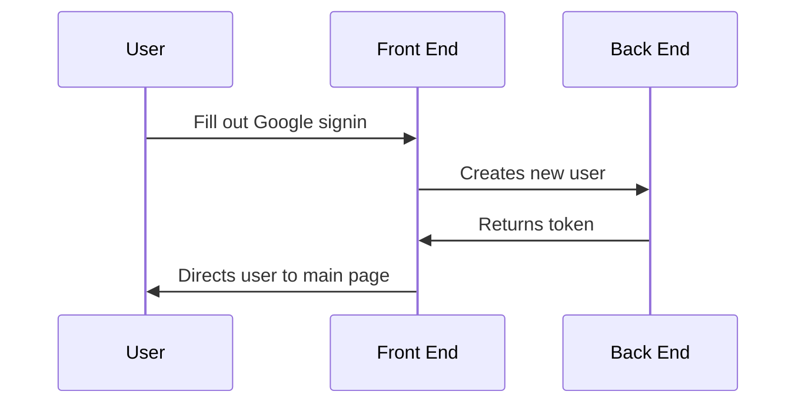
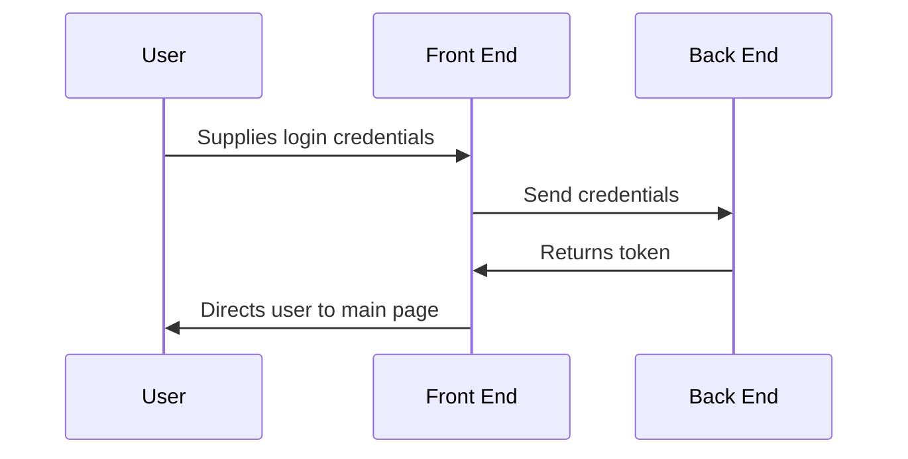
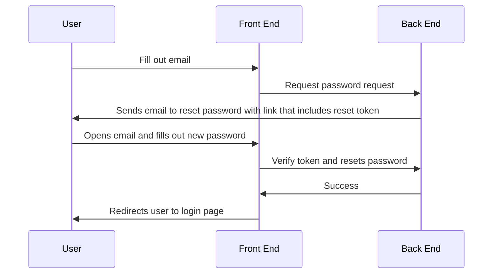

# Login Diagrams

## Sequence Diagrams

### User Register

- Password must be longer than 8 characters with one number and one special character
- User must have a @maine.edu email domain during registration

### User Register Through Google

- Google account handles verification of email as the user logs in with user

### User Login

_We could setup a browser to remember me on login in future feature_

### User Forgot Password

- User must be verified

