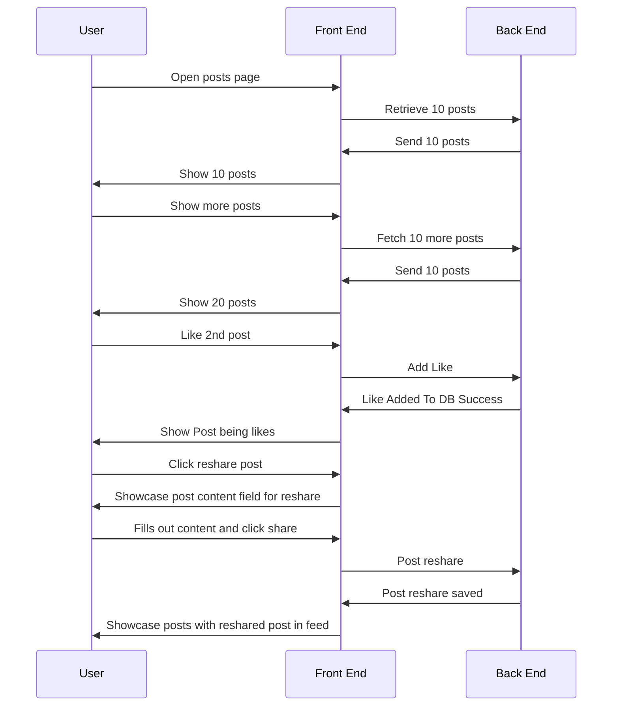
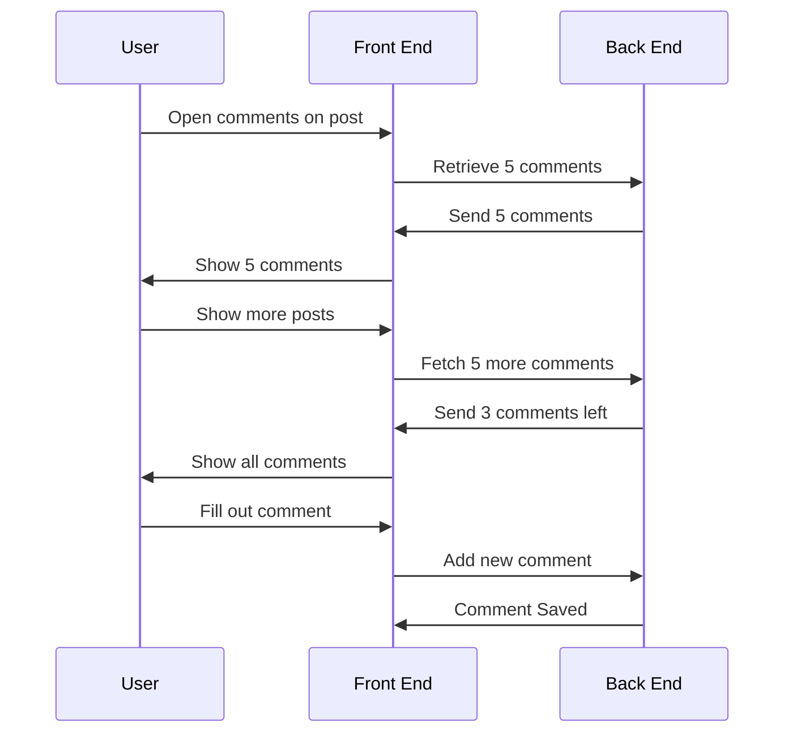

# Post Diagram

## Interaction of Posts Sequence

```mermaid
sequenceDiagram
    User->>Front End: Open posts page
    Front End->>Back End: Retrieve 10 posts
    Back End->>Front End: Send 10 posts
    Front End->>User: Show 10 posts
    User->>Front End: Show more posts
    Front End->>Back End: Fetch 10 more posts
    Back End->>Front End: Send 10 posts
    Front End->>User: Show 20 posts
    User->>Front End: Like 2nd post
    Front End->>Back End: Add Like
    Back End->>Front End: Like Added To DB Success
    Front End->>User: Show Post being likes
    User->>Front End: Click reshare post
    Front End->>User: Showcase post content field for reshare
    User->>Front End: Fills out content and click share
    Front End->>Back End: Post reshare
    Back End->>Front End: Post reshare saved
    Front End->>User: Showcase posts with reshared post in feed
```

## Comments Sequence

```mermaid
sequenceDiagram
    User->>Front End: Open comments on post
    Front End->>Back End: Retrieve 5 comments
    Back End->>Front End: Send 5 comments
    Front End->>User: Show 5 comments
    User->>Front End: Show more posts
    Front End->>Back End: Fetch 5 more comments
    Back End->>Front End: Send 3 comments left
    Front End->>User: Show all comments
    User->>Front End: Fill out comment
    Front End->>Back End: Add new comment
    Back End->> Front End: Comment Saved
```